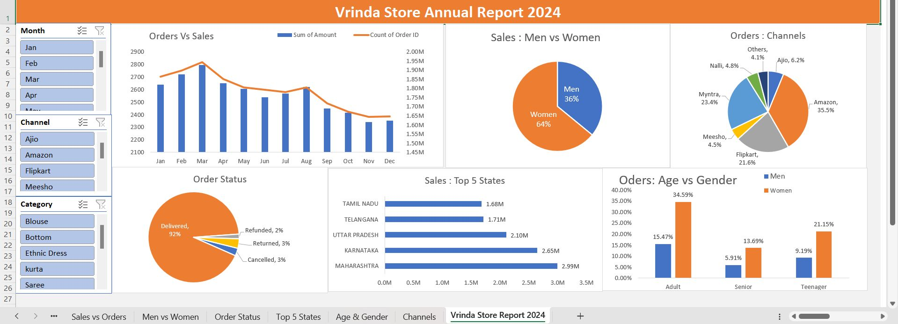

# Vrinda Store - Sales Analysis (Excel Project)

 
## Dashboard Overview
The image above shows a dynamic Excel dashboard created using Pivot Tables and Charts. It includes key metrics like Orders vs Sales, Channel-wise Orders, Regional Performance, Gender and Age-based Segmentation, and Order Status.

## Project Objective
- Clean and organize raw sales data.
- Perform descriptive analysis to understand sales trends.
- Create Pivot Tables to summarize sales by Product, Category, and Region.
- Generate visual charts for better representation of insights.

## Tools Used
- Microsoft Excel

## Key Analysis Performed
- Total Sales, Average Sales
- Product-wise and Category-wise Sales Summary
- Regional Sales Performance
- Customer Segmentation
- Pivot Tables and Pivot Charts

## How to Use
- Open the `.xlsx` file in Microsoft Excel.
- Explore different sheets for detailed analysis and dashboards.

## Learnings
- Improved Excel skills such as data cleaning, formula applications, and Pivot Table creation.
